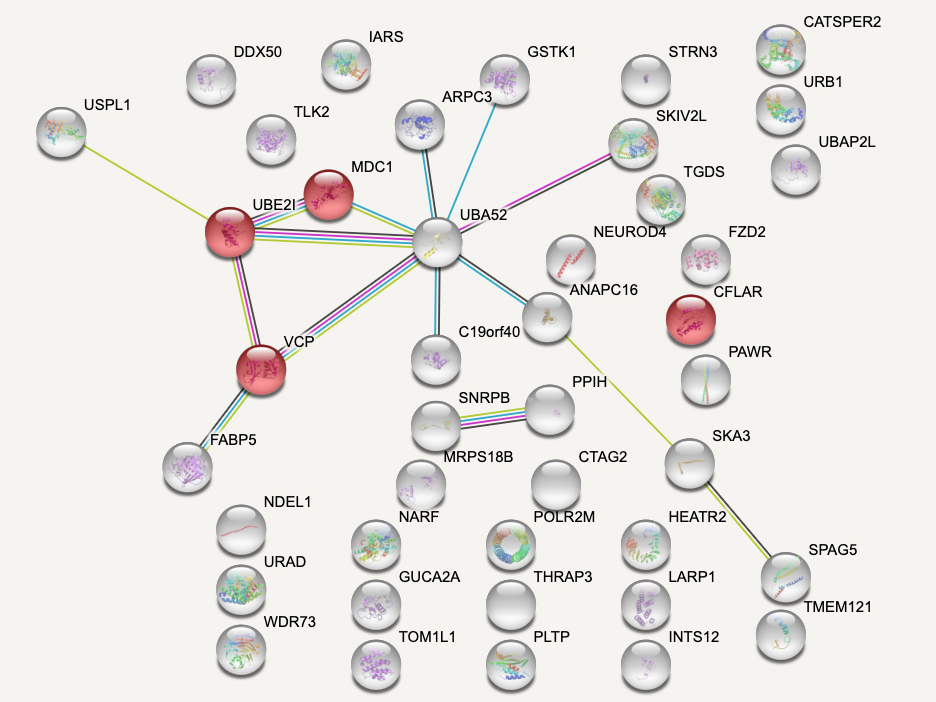
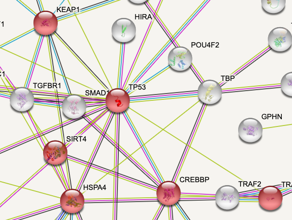
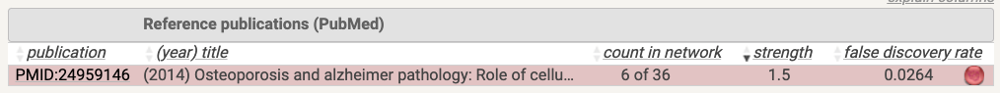

# Setup

```{r}
options(warn=-1)

suppressMessages(library(knitr))
suppressMessages(library(magrittr))
suppressMessages(library(ggplot2))
suppressMessages(library(dplyr))
suppressMessages(library(crispRutils))

base_path <- "~/data/az_cruk/fgc_0013a--02-reseq"
base_path.orig <- "~/data/az_cruk/fgc_0013a--old"

```

# ARH3 -/-

## HeLa

### Day 17

```{r}
hela.arh3_day17 <- crispRutils::run_synth_lethal_analysis(file.path(base_path, "HeLa-DiffLeth-parental-ARH3-day17"))

plot(hela.arh3_day17, type = "plasmid", remove_multimappers = T, 
     library_name = "yusa_v3_human", library_type = "n", library_annotation_version = 1)

plot(hela.arh3_day17, type = "treat", remove_multimappers = T, 
     library_name = "yusa_v3_human", library_type = "n", library_annotation_version = 1)

```

## U2OS

### Day 16

```{r}
u2os.arh3_day16 <- crispRutils::run_synth_lethal_analysis(file.path(base_path, "U2OS-DiffLeth-parental-ARH3-day16"))

plot(u2os.arh3_day16, type = "plasmid", remove_multimappers = T, 
     library_name = "yusa_v3_human", library_type = "n", library_annotation_version = 1)

plot(u2os.arh3_day16, type = "treat", remove_multimappers = T, 
     library_name = "yusa_v3_human", library_type = "n", library_annotation_version = 1)

```

# HPF1 -/-

## HeLa

### Day 17

```{r}
hela.hpf1_day17 <- crispRutils::run_synth_lethal_analysis(file.path(base_path, "HeLa-DiffLeth-parental-HPF1-day17"))

plot(hela.hpf1_day17, type = "plasmid", remove_multimappers = T, 
     library_name = "yusa_v3_human", library_type = "n", library_annotation_version = 1)

plot(hela.hpf1_day17, type = "treat", remove_multimappers = T, 
     library_name = "yusa_v3_human", library_type = "n", library_annotation_version = 1)

```

# Shared Depletion Hits

## HeLa ARH3-/-

```{r}
# Read Desirability data from day 7 and 17 (re-seq) and day 17 (original).
desir.hela_arh3.day7 <- read_desirability_scores(file.path(base_path.orig,"HeLa-DiffLeth-parental-ARH3-day7"))
desir.hela_arh3.day17 <- read_desirability_scores(file.path(base_path,"HeLa-DiffLeth-parental-ARH3-day17"))
desir.hela_arh3.day7.orig <- read_desirability_scores(file.path(base_path.orig,"HeLa-DiffLeth-parental-ARH3-day7"))
hela.arh3.des <- join_desirability_scores(desir.hela_arh3.day7,
                                          desir.hela_arh3.day17,
                                          desir.hela_arh3.day17.orig,
                                          names = c("hela_arh3_day7","hela_arh3_day17","hela_arh3_day7.orig"),
                                          type = "neg")
```

```{r, cache=TRUE}
fdr_thresh.hela_arh3 <- find_desir_threshold_for_FDR(hela.arh3.des, start_desir = 0.9)
dthresh.hela_arh3 <- (fdr_thresh.hela_arh3 %>%
                        dplyr::filter(FDR.common < 0.1) %>%
                        dplyr::filter(FDR.common == max(FDR.common)))$Desir_threshold
```

```{r}
hits.hela.arh3.des <- (hela.arh3.des %>%
  crispRutils:::.prep_4_mle(dthresh.hela_arh3) %>%
  dplyr::filter(total == 2))$gene

```




## U2OS ARH3-/-

```{r}
# Read Desirability data from day 7 and 17.
u2os.arh3.des <- join_desirability_scores(read_desirability_scores(file.path(base_path.orig,"U2OS-DiffLeth-parental-ARH3-day9")),
                                          read_desirability_scores(file.path(base_path,"U2OS-DiffLeth-parental-ARH3-day16")),
                                          names = c("u2os_arh3_day9","u2os_arh3_day16"),
                                          type = "neg")
```

```{r, cache=TRUE}
fdr_thresh.u2os_arh3 <- find_desir_threshold_for_FDR(u2os.arh3.des, start_desir = 0.9, stop_desir = 0.4)
dthresh.u2os_arh3 <- (fdr_thresh.u2os_arh3 %>%
                        dplyr::filter(FDR.common < 0.05) %>%
                        dplyr::filter(FDR.common == max(FDR.common)))$Desir_threshold
```

```{r}
hits.u2os.arh3.des <- (u2os.arh3.des %>%
  crispRutils:::.prep_4_mle(dthresh.u2os_arh3) %>%
  dplyr::filter(total == 2))$gene

```






# QC

## HeLa ARH3 Day 17

```{r}
qc.hela.arh3_day17 <- readRDS(file.path(base_path,"HeLa-DiffLeth-parental-ARH3-day17/qc/QC_fgc.rds"))

qc.hela.arh3_day17$qc_metrics %>%
  dplyr::select(SampleName,gini_coefficient_counts)

crispRutils::annotate_gene_sets_lfc_grna(qc.hela.arh3_day17) %>%
  plot()

crispRutils::plot_perf_curves_fgcQC(qc.hela.arh3_day17, "PrRc")

```

## HeLa HPF1 Day 17

```{r}
qc.hela.hpf1_day17 <- readRDS(file.path(base_path,"HeLa-DiffLeth-parental-HPF1-day17/qc/QC_fgc.rds"))

qc.hela.hpf1_day17$qc_metrics %>%
  dplyr::select(SampleName,gini_coefficient_counts)

crispRutils::annotate_gene_sets_lfc_grna(qc.hela.hpf1_day17) %>%
  plot()

crispRutils::plot_perf_curves_fgcQC(qc.hela.hpf1_day17, "PrRc")

```

## U2OS ARH3 Day 16

```{r}
qc.u2os.arh3_day16 <- readRDS(file.path(base_path,"U2OS-DiffLeth-parental-ARH3-day16/qc/QC_fgc.rds"))

qc.u2os.arh3_day16$qc_metrics %>%
  dplyr::select(SampleName,gini_coefficient_counts)

crispRutils::annotate_gene_sets_lfc_grna(qc.u2os.arh3_day16) %>%
  plot()

crispRutils::plot_perf_curves_fgcQC(qc.u2os.arh3_day16, "PrRc")

```

