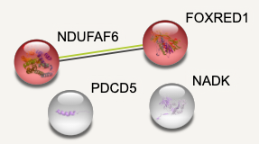
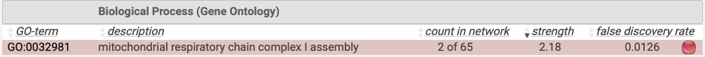
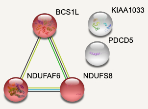
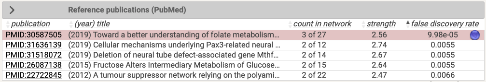
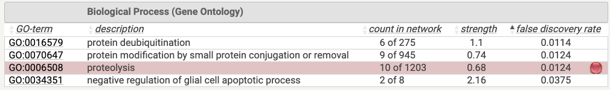
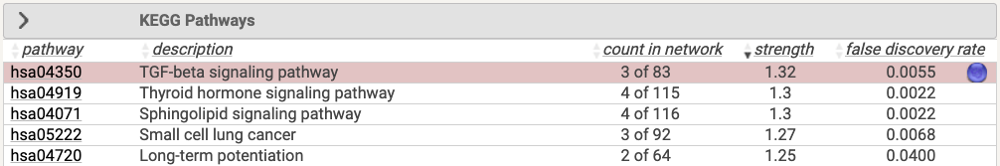
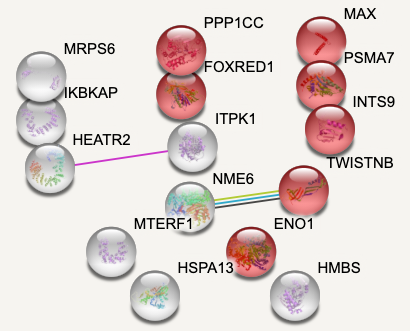

# Setup

```{r}
options(warn=-1)

suppressMessages(library(knitr))
suppressMessages(library(magrittr))
suppressMessages(library(ggplot2))
suppressMessages(library(dplyr))
suppressMessages(library(crispRutils))

base_path <- "~/data/az_cruk/fgc_0013a--02-reseq"
base_path.orig <- "~/data/az_cruk/fgc_0013a--old"

# Pre-computed hits (slow to process from scratch).
hits.hela.arh3.des <- readRDS(file="../data/hits.hela.arh3.des.rds")
hits.u2os.arh3.des <- readRDS(file="../data/hits.u2os.arh3.des.rds")

```

# Analysis approach

Two approaches are taken as we have a weak signal in the data:

1. Synthetic lethality analysis.
2. Shared depletion analysis.

**Synthetic lethality:**
Candidate genes are called if they satisfy both of the following criteria:

* Called as essential in the Mutant (Bagel or Mageck) and **not** called as essential in the Wild-Type (Bagel or Mageck).
* A False Discovery Rate (FDR) < 0.1 in Mutant versus Wild-Type Mageck comparison for negative fold-change cases.

**Shared depletion:**
For Mutant versus Wild-Type comparisons, candidate genes are called if they are shared across several screens (different time-points and re-sequenced lines) according to a Desirability threshold that corresponds to an FDR of the shared hits that is <10\% (defined using a maximum likelihood approach). These candidates are depleted in the Mutant relative to the Wild-Type and can in principle fall into two groups:

* Weak depletion in Mutant, no depletion in Wild-Type.
* Depleted in both Mutant and Wild-Type, but more strongly depleted in the Mutant.

# Synthetic lethality analysis

## ARH3 -/-

### HeLa

#### Day 17

No synthetic lethals here.

```{r}
hela.arh3_day17 <- crispRutils::run_synth_lethal_analysis(file.path(base_path, "HeLa-DiffLeth-parental-ARH3-day17"))

plot(hela.arh3_day17, type = "plasmid", remove_multimappers = T, 
     library_name = "yusa_v3_human", library_type = "n", library_annotation_version = 1)

plot(hela.arh3_day17, type = "treat", remove_multimappers = T, 
     library_name = "yusa_v3_human", library_type = "n", library_annotation_version = 1)

```

### U2OS

#### Day 9 - original

At day 9, **RNF4** is the sole synthetic lethal: a transcription factor with a role in the [DNA-ds-break response](https://www.ncbi.nlm.nih.gov/pmc/articles/PMC5391139/).

There are 4 genes that have lost essentiality in the U2OS ARH3-/- KO cell line and they are weakly enriched for 'mitochondrial respiratory chain complex I assembly'

```{r}
u2os.arh3_day9.orig <- crispRutils::run_synth_lethal_analysis(file.path(base_path.orig, "U2OS-DiffLeth-parental-ARH3-day9"))

plot(u2os.arh3_day9.orig, type = "plasmid", remove_multimappers = T, 
     library_name = "yusa_v3_human", library_type = "n", library_annotation_version = 1)

plot(u2os.arh3_day9.orig, type = "treat", remove_multimappers = T, 
     library_name = "yusa_v3_human", library_type = "n", library_annotation_version = 1)

u2os.day9.lost_ess <- u2os.arh3_day9.orig$mageck_treat_vs_ctrl_ess_annot %>%
  dplyr::filter(type == "Loss-Ess")

```





#### Day 16

At day 16, **BIRC2** is the sole synthetic lethal gene: an [inhibitor of apoptosis](https://en.wikipedia.org/wiki/Baculoviral_IAP_repeat-containing_protein_2).

There are 5 genes that have lost essentiality in the U2OS ARH3-/- KO cell line and they are strongly enriched for 'mitochondrial respiratory chain complex I assembly'.

```{r}
u2os.arh3_day16 <- crispRutils::run_synth_lethal_analysis(file.path(base_path, "U2OS-DiffLeth-parental-ARH3-day16"))

plot(u2os.arh3_day16, type = "plasmid", remove_multimappers = T, 
     library_name = "yusa_v3_human", library_type = "n", library_annotation_version = 1)

plot(u2os.arh3_day16, type = "treat", remove_multimappers = T, 
     library_name = "yusa_v3_human", library_type = "n", library_annotation_version = 1)

u2os.day16.lost_ess <- u2os.arh3_day16$mageck_treat_vs_ctrl_ess_annot %>%
  dplyr::filter(type == "Loss-Ess")

```




## HPF1 -/-

### HeLa

#### Day 17

There are no synthetic lethal hits, but there are 6 genes that have lost essentiality in the HeLa HPF1-/- cell line. They are enriched for 'folic acid metabolic process'.

```{r}
hela.hpf1_day17 <- crispRutils::run_synth_lethal_analysis(file.path(base_path, "HeLa-DiffLeth-parental-HPF1-day17"))

plot(hela.hpf1_day17, type = "plasmid", remove_multimappers = T, 
     library_name = "yusa_v3_human", library_type = "n", library_annotation_version = 1)

plot(hela.hpf1_day17, type = "treat", remove_multimappers = T, 
     library_name = "yusa_v3_human", library_type = "n", library_annotation_version = 1)

hela.hpf1.day17.lost_ess <- hela.hpf1_day17$mageck_treat_vs_ctrl_ess_annot %>%
  dplyr::filter(type == "Loss-Ess")

```




# Shared Depletion analysis

## HeLa ARH3-/-

```{r}
# Read Desirability data from day 7 and 17 (re-seq) and day 17 (original).
desir.hela_arh3.day17 <- read_desirability_scores(file.path(base_path,"HeLa-DiffLeth-parental-ARH3-day17"))
desir.hela_arh3.day7.orig <- read_desirability_scores(file.path(base_path.orig,"HeLa-DiffLeth-parental-ARH3-day7"))
hela.arh3.des <- join_desirability_scores(desir.hela_arh3.day17,
                                          desir.hela_arh3.day7.orig,
                                          names = c("hela_arh3_day7.orig","hela_arh3_day17"),
                                          type = "neg")
```

```{r, eval=FALSE}
fdr_thresh.hela_arh3 <- find_desir_threshold_for_FDR(hela.arh3.des, start_desir = 0.9, stop_desir = 0.4)

dthresh.hela_arh3 <- 0.5
hits.hela.arh3.des <- (hela.arh3.des %>%
  crispRutils:::.prep_4_mle(dthresh.hela_arh3) %>%
  dplyr::filter(total == 2))$gene

```


## U2OS ARH3-/-

```{r}
# Read Desirability data from day 9 and 16, both original and re-seq.
desir.u2os.arh3.day16 <- read_desirability_scores(file.path(base_path,"U2OS-DiffLeth-parental-ARH3-day16"))
desir.u2os.arh3.day9.orig <- read_desirability_scores(file.path(base_path.orig,"U2OS-DiffLeth-parental-ARH3-day9"))
desir.u2os.arh3.day16.orig <- read_desirability_scores(file.path(base_path.orig,"U2OS-DiffLeth-parental-ARH3-day16"))
u2os.arh3.des <- join_desirability_scores(desir.u2os.arh3.day16,
                                          desir.u2os.arh3.day9.orig,
                                          desir.u2os.arh3.day16.orig,
                                          names = c("u2os_arh3_day16","u2os_arh3_day9.orig","u2os_arh3_day16.orig"),
                                          type = "neg")
```

```{r, eval=FALSE}
fdr_thresh.u2os_arh3 <- find_desir_threshold_for_FDR(u2os.arh3.des, start_desir = 0.9, stop_desir = 0.5)

dthresh.u2os_arh3 <- 0.5
hits.u2os.arh3.des <- (u2os.arh3.des %>%
  crispRutils:::.prep_4_mle(dthresh.u2os_arh3) %>%
  dplyr::filter(total == 3))$gene

```






## HeLa HPF1-/-

```{r}
# Read Desirability data from day 7 and 17 (re-seq) and day 17 (original).
desir.hela_hpf1.day17.orig <- read_desirability_scores(file.path(base_path.orig,"HeLa-DiffLeth-parental-HPF1-day17"))
desir.hela_hpf1.day17 <- read_desirability_scores(file.path(base_path,"HeLa-DiffLeth-parental-HPF1-day17"))
hela.hpf1.des <- join_desirability_scores(desir.hela_hpf1.day17.orig,
                                          desir.hela_hpf1.day17,
                                          names = c("hela_hpf1_day17.orig","hela_hpf1_day17"),
                                          type = "neg")
```

```{r, cache=TRUE}
fdr_thresh.hela_hpf1 <- find_desir_threshold_for_FDR(hela.hpf1.des, start_desir = 0.9, stop_desir = 0.5)
dthresh.hela_hpf1 <- 0.9

hits.hela.hpf1.des <- (hela.hpf1.des %>%
  crispRutils:::.prep_4_mle(dthresh.hela_hpf1) %>%
  dplyr::filter(total == 2))$gene

```




# QC

## HeLa ARH3 Day 17

```{r}
qc.hela.arh3_day17 <- readRDS(file.path(base_path,"HeLa-DiffLeth-parental-ARH3-day17/qc/QC_fgc.rds"))

qc.hela.arh3_day17$qc_metrics %>%
  dplyr::select(SampleName,gini_coefficient_counts)

crispRutils::annotate_gene_sets_lfc_grna(qc.hela.arh3_day17) %>%
  plot()

crispRutils::plot_perf_curves_fgcQC(qc.hela.arh3_day17, "PrRc")

```

## HeLa HPF1 Day 17

```{r}
qc.hela.hpf1_day17 <- readRDS(file.path(base_path,"HeLa-DiffLeth-parental-HPF1-day17/qc/QC_fgc.rds"))

qc.hela.hpf1_day17$qc_metrics %>%
  dplyr::select(SampleName,gini_coefficient_counts)

crispRutils::annotate_gene_sets_lfc_grna(qc.hela.hpf1_day17) %>%
  plot()

crispRutils::plot_perf_curves_fgcQC(qc.hela.hpf1_day17, "PrRc")

```

## U2OS ARH3 Day 16

```{r}
qc.u2os.arh3_day16 <- readRDS(file.path(base_path,"U2OS-DiffLeth-parental-ARH3-day16/qc/QC_fgc.rds"))

qc.u2os.arh3_day16$qc_metrics %>%
  dplyr::select(SampleName,gini_coefficient_counts)

crispRutils::annotate_gene_sets_lfc_grna(qc.u2os.arh3_day16) %>%
  plot()

crispRutils::plot_perf_curves_fgcQC(qc.u2os.arh3_day16, "PrRc")

```

