# Setup

```{r}
options(warn=-1)

suppressMessages(library(knitr))
suppressMessages(library(magrittr))
suppressMessages(library(ggplot2))
suppressMessages(library(GGally))
suppressMessages(library(dplyr))
suppressMessages(library(crispRutils))

base_path <- "~/data/az_cruk/fgc_0013b-added-seq"

# Shared depletion hits from FGC_0013a.
sdepl.hela.arh3 <- readRDS(file="../data/hits.hela.arh3.des.rds")
sdepl.u2os.arh3 <- readRDS(file="../data/hits.u2os.arh3.des.rds")

```

# Synthetic Lethality Analysis

## ARH3 -/-

### A549

#### Day 14

There are 78 synthetic lethal genes with a strong enrichment of protein interactions (*P* = 7.14e-6). They are enriched for 'cellular response to hypoxia' and 'p53 signaling pathway'. One gene is shared in common with the shared depletion hits of HeLa ARH3-/- (FGC_0013a): CFLAR, an [apoptosis regulator](https://en.wikipedia.org/wiki/CFLAR).

There are 152 genes that have lost essentiality in the knock-out line and they have a strong enrichment of protein interactions (*P* = 4.27e-13), and are strongly enriched for 'folic acid metabolism', which was also an enrichment for genes that had lost essentiality in the original HeLa HPF1-/- screen (FGC_0013a), and also enriched for 'cell cycle process'.

```{r}
a549.arh3_day14 <- crispRutils::run_synth_lethal_analysis(file.path(base_path, "A549-DiffLeth-WT-ARH3-day14"))

plot(a549.arh3_day14, type = "plasmid", remove_multimappers = T, 
     library_name = "yusa_v3_human", library_type = "n", library_annotation_version = 1)

plot(a549.arh3_day14, type = "treat", remove_multimappers = T, 
     library_name = "yusa_v3_human", library_type = "n", library_annotation_version = 1)

hits.a549.arh3.day14 <- a549.arh3_day14$mageck_treat_vs_ctrl_ess_annot %>%
  filter(type == "Gain-Ess") %>%
  select(id,neg.lfc,neg.fdr) %>%
  arrange(neg.fdr)

write.csv(hits.a549.arh3.day14, file = "../data/fgc_0013b/fgc_0013b-synth-lethals-a549-arh3-day14--reseq.csv", 
          row.names = F, quote=F)

# Loss of essentiality in KO.
loss_ess.a549.arh3.day14 <- a549.arh3_day14$mageck_treat_vs_ctrl_ess_annot %>%
  filter(type == "Loss-Ess") %>%
  select(id,pos.lfc,pos.fdr) %>%
  arrange(pos.fdr)

write.csv(loss_ess.a549.arh3.day14, file = "../data/fgc_0013b/fgc_0013b-loss-ess-a549-arh3-day14--reseq.csv", 
          row.names = F, quote=F)

```

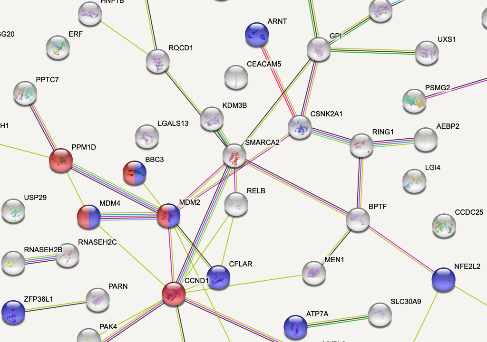
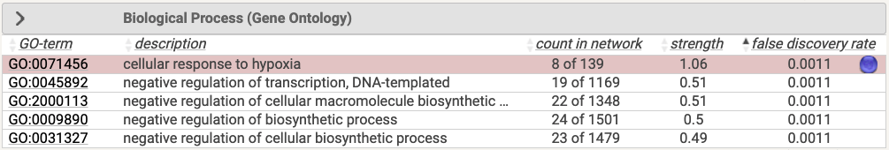
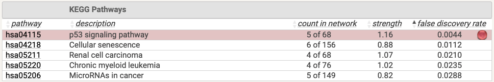

#### Day 21

There is only one synthetic lethal at day 21: MBNL1, an [RNA-splicing protein](https://en.wikipedia.org/wiki/MBNL1).

```{r}
a549.arh3_day21 <- crispRutils::run_synth_lethal_analysis(file.path(base_path, "A549-DiffLeth-WT-ARH3-day21"))

plot(a549.arh3_day21, type = "plasmid", remove_multimappers = T, 
     library_name = "yusa_v3_human", library_type = "n", library_annotation_version = 1)

plot(a549.arh3_day21, type = "treat", remove_multimappers = T, 
     library_name = "yusa_v3_human", library_type = "n", library_annotation_version = 1)

```

## TARG1 -/-

### HeLa

#### Day 11

There are 62 synthetic lethality hits that are enriched for 'apoptotic signaling in response to ER stress'.

```{r}
hela.targ1_day11 <- crispRutils::run_synth_lethal_analysis(file.path(base_path, "HeLa-DiffLeth-WT-TARG1-day11"))

plot(hela.targ1_day11, type = "plasmid", remove_multimappers = T, 
     library_name = "yusa_v3_human", library_type = "n", library_annotation_version = 1)

plot(hela.targ1_day11, type = "treat", remove_multimappers = T, 
     library_name = "yusa_v3_human", library_type = "n", library_annotation_version = 1)

hits.hela.targ1.day11 <- hela.targ1_day11$mageck_treat_vs_ctrl_ess_annot %>%
  filter(type == "Gain-Ess") %>%
  select(id,neg.lfc,neg.fdr) %>%
  arrange(neg.fdr)

write.csv(hits.hela.targ1.day11, file = "../data/fgc_0013b/fgc_0013b-synth-lethals-hela-targ1-day11.csv", row.names = F, quote=F)

```

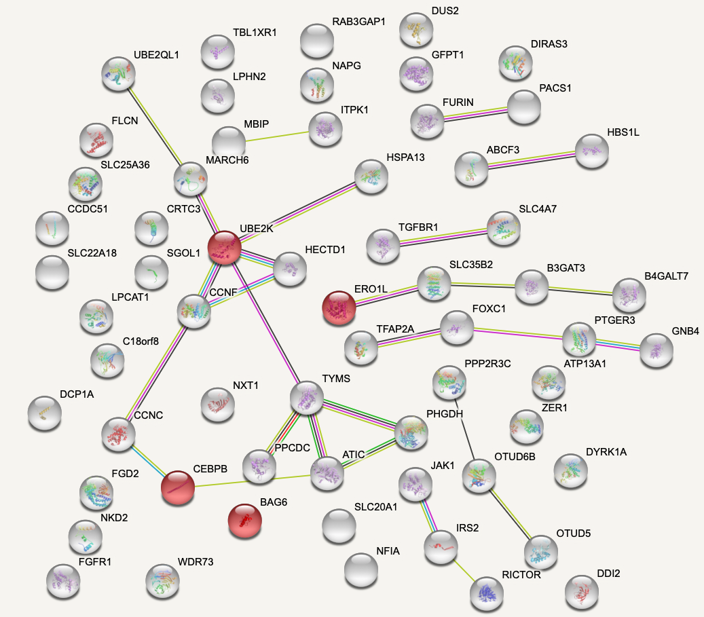


#### Day 18

There are no synthetic lethal hits at day 18.

```{r}
hela.targ1_day18 <- crispRutils::run_synth_lethal_analysis(file.path(base_path, "HeLa-DiffLeth-WT-TARG1-day18"))

plot(hela.targ1_day18, type = "plasmid", remove_multimappers = T, 
     library_name = "yusa_v3_human", library_type = "n", library_annotation_version = 1)

plot(hela.targ1_day18, type = "treat", remove_multimappers = T, 
     library_name = "yusa_v3_human", library_type = "n", library_annotation_version = 1)

```

### U2OS

#### Day 14

There are 76 synthetic lethals at day 14 and they are strongly enriched for protein interactions (*P* < 1e-16). They are also strongly enriched for 'cellular respiration' and presence in the mitochondrion.

```{r}
u2os.targ1_day14 <- crispRutils::run_synth_lethal_analysis(file.path(base_path, "U2OS-DiffLeth-WT-TARG1-day14"))

plot(u2os.targ1_day14, type = "plasmid", remove_multimappers = T, 
     library_name = "yusa_v3_human", library_type = "n", library_annotation_version = 1)

plot(u2os.targ1_day14, type = "treat", remove_multimappers = T, 
     library_name = "yusa_v3_human", library_type = "n", library_annotation_version = 1)

hits.u2os.targ1.day14 <- u2os.targ1_day14$mageck_treat_vs_ctrl_ess_annot %>%
  filter(type == "Gain-Ess") %>%
  select(id,neg.lfc,neg.fdr) %>%
  arrange(neg.fdr)

write.csv(hits.u2os.targ1.day14, file = "../data/fgc_0013b/fgc_0013b-synth-lethals-u2os-targ1-day14.csv", row.names = F, quote=F)

```

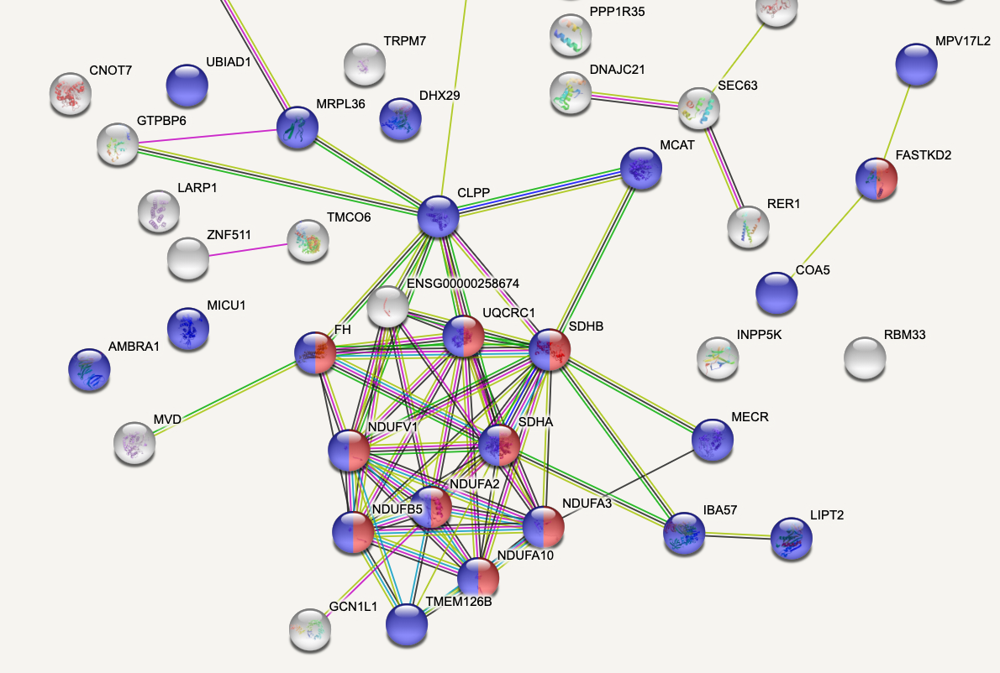
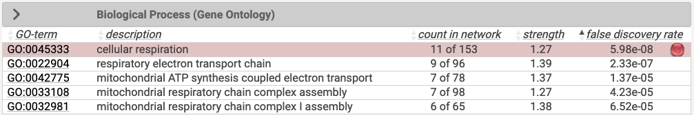
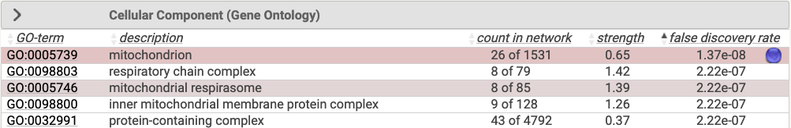

#### Day 18

There are 14 synthetic lethals at day 18 and they are enriched for 'mTOR signaling pathway' and 'nuclear envelope reassembly'. Day 18 and day 14 share 11 of their synthetic lethal hits.

```{r}
u2os.targ1_day18 <- crispRutils::run_synth_lethal_analysis(file.path(base_path, "U2OS-DiffLeth-WT-TARG1-day18"))

plot(u2os.targ1_day18, type = "plasmid", remove_multimappers = T, 
     library_name = "yusa_v3_human", library_type = "n", library_annotation_version = 1)

plot(u2os.targ1_day18, type = "treat", remove_multimappers = T, 
     library_name = "yusa_v3_human", library_type = "n", library_annotation_version = 1)

hits.u2os.targ1.day18 <- u2os.targ1_day18$mageck_treat_vs_ctrl_ess_annot %>%
  filter(type == "Gain-Ess") %>%
  select(id,neg.lfc,neg.fdr) %>%
  arrange(neg.fdr)

write.csv(hits.u2os.targ1.day18, file = "../data/fgc_0013b/fgc_0013b-synth-lethals-u2os-targ1-day18.csv", row.names = F, quote=F)

```

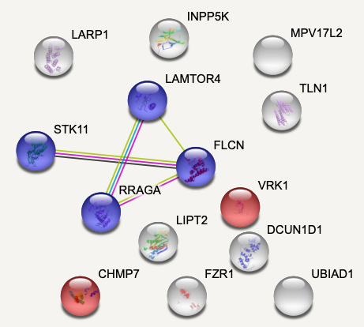
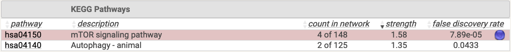


## HPF1-/-

### U2OS

#### Day 14

There are 14 synthetic lethals at day 14 with a weak enrichment for 'peroxisome' and 'vesicle organization'.

```{r}
u2os.hpf1_day14 <- crispRutils::run_synth_lethal_analysis(file.path(base_path, "U2OS-DiffLeth-WT-HPF1-day14"))

plot(u2os.hpf1_day14, type = "plasmid", remove_multimappers = T, 
     library_name = "yusa_v3_human", library_type = "n", library_annotation_version = 1)

plot(u2os.hpf1_day14, type = "treat", remove_multimappers = T, 
     library_name = "yusa_v3_human", library_type = "n", library_annotation_version = 1)

hits.u2os.hpf1.day14 <- u2os.hpf1_day14$mageck_treat_vs_ctrl_ess_annot %>%
  filter(type == "Gain-Ess") %>%
  select(id,neg.lfc,neg.fdr) %>%
  arrange(neg.fdr)

write.csv(hits.u2os.hpf1.day14, file = "../data/fgc_0013b/fgc_0013b-synth-lethals-u2os-hpf1-day14.csv", row.names = F, quote=F)

```

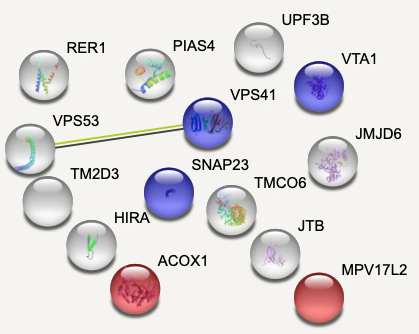

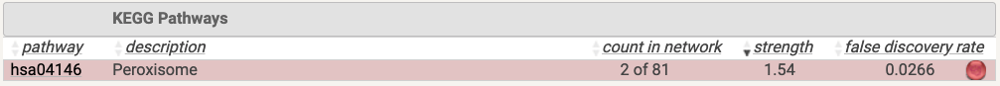
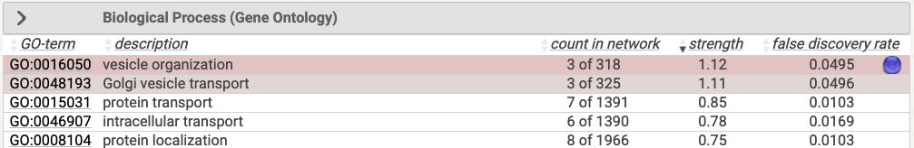

#### Day 21

There is one hit at day 21, UBE2O, a [ubiquitin-conjugating enzyme](https://en.wikipedia.org/wiki/UBE2O).

```{r}
u2os.hpf1_day21 <- crispRutils::run_synth_lethal_analysis(file.path(base_path, "U2OS-DiffLeth-WT-HPF1-day21"))

plot(u2os.hpf1_day21, type = "plasmid", remove_multimappers = T, 
     library_name = "yusa_v3_human", library_type = "n", library_annotation_version = 1)

plot(u2os.hpf1_day21, type = "treat", remove_multimappers = T, 
     library_name = "yusa_v3_human", library_type = "n", library_annotation_version = 1)

```


# QC

## HeLa TARG1 Day 11

```{r}
qc.hela.targ1_day11 <- readRDS(file.path(base_path,"HeLa-DiffLeth-WT-TARG1-day11/qc/QC_fgc.rds"))

crispRutils::annotate_gene_sets_lfc_grna(qc.hela.targ1_day11) %>%
  plot()

crispRutils::plot_perf_curves_fgcQC(qc.hela.targ1_day11, "PrRc")

```

## HeLa TARG1 Day 18

```{r}
qc.hela.targ1_day18 <- readRDS(file.path(base_path,"HeLa-DiffLeth-WT-TARG1-day18/qc/QC_fgc.rds"))

crispRutils::annotate_gene_sets_lfc_grna(qc.hela.targ1_day18) %>%
  plot()

crispRutils::plot_perf_curves_fgcQC(qc.hela.targ1_day18, "PrRc")

```

## A549 ARH3 Day 14

```{r}
qc.a549.arh3_day14 <- readRDS(file.path(base_path,"A549-DiffLeth-WT-ARH3-day14/qc/QC_fgc.rds"))

crispRutils::annotate_gene_sets_lfc_grna(qc.a549.arh3_day14) %>%
  plot()

crispRutils::plot_perf_curves_fgcQC(qc.a549.arh3_day14, "PrRc")

```

## A549 ARH3 Day 21

```{r}
qc.a549.arh3_day21 <- readRDS(file.path(base_path,"A549-DiffLeth-WT-ARH3-day21/qc/QC_fgc.rds"))

crispRutils::annotate_gene_sets_lfc_grna(qc.a549.arh3_day21) %>%
  plot()

crispRutils::plot_perf_curves_fgcQC(qc.a549.arh3_day21, "PrRc")

```

## U2OS HPF1 Day 14

```{r}
qc.u2os.hpf1_day14 <- readRDS(file.path(base_path,"U2OS-DiffLeth-WT-HPF1-day14/qc/QC_fgc.rds"))

crispRutils::annotate_gene_sets_lfc_grna(qc.u2os.hpf1_day14) %>%
  plot()

crispRutils::plot_perf_curves_fgcQC(qc.u2os.hpf1_day14, "PrRc")

```

## U2OS HPF1 Day 21

```{r}
qc.u2os.hpf1_day21 <- readRDS(file.path(base_path,"U2OS-DiffLeth-WT-HPF1-day21/qc/QC_fgc.rds"))

crispRutils::annotate_gene_sets_lfc_grna(qc.u2os.hpf1_day21) %>%
  plot()

crispRutils::plot_perf_curves_fgcQC(qc.u2os.hpf1_day21, "PrRc")

```

## U2OS TARG1 Day 14

```{r}
qc.u2os.targ1_day14 <- readRDS(file.path(base_path,"U2OS-DiffLeth-WT-TARG1-day14/qc/QC_fgc.rds"))

crispRutils::annotate_gene_sets_lfc_grna(qc.u2os.targ1_day14) %>%
  plot()

crispRutils::plot_perf_curves_fgcQC(qc.u2os.targ1_day14, "PrRc")

```

## U2OS TARG1 Day 18

```{r}
qc.u2os.targ1_day18 <- readRDS(file.path(base_path,"U2OS-DiffLeth-WT-TARG1-day18/qc/QC_fgc.rds"))

crispRutils::annotate_gene_sets_lfc_grna(qc.u2os.targ1_day18) %>%
  plot()

crispRutils::plot_perf_curves_fgcQC(qc.u2os.targ1_day18, "PrRc")

```


