# Setup

```{r}
options(warn=-1)

suppressMessages(library(knitr))
suppressMessages(library(magrittr))
suppressMessages(library(ggplot2))
suppressMessages(library(GGally))
suppressMessages(library(dplyr))
suppressMessages(library(crispRutils))

base_path <- "~/data/az_cruk/fgc_0013b"
base_path.bl <- "~/data/az_cruk/fgc_0013b-baseline-comparison"

# Shared depletion hits from FGC_0013a.
sdepl.hela.arh3 <- readRDS(file="../data/hits.hela.arh3.des.rds")
sdepl.u2os.arh3 <- readRDS(file="../data/hits.u2os.arh3.des.rds")

```

# Synthetic Lethality Analysis

## ARH3 -/-

### A549

```{r,echo=F,eval=F}
# Baseline comparison.
a549.arh3_day0 <- crispRutils::run_synth_lethal_analysis(file.path(base_path.bl, "A549-DiffLeth-WT-ARH3-day0"))

plot(a549.arh3_day0, type = "plasmid", remove_multimappers = T, 
     library_name = "yusa_v3_human", library_type = "n", library_annotation_version = 1)

plot(a549.arh3_day0, type = "treat", remove_multimappers = T, 
     library_name = "yusa_v3_human", library_type = "n", library_annotation_version = 1)

```

#### Day 14

There are 78 synthetic lethal genes with a strong enrichment of protein interactions (*P* = 8.47e-5). They are enriched for 'cellular response to hypoxia'. One gene is shared in common with the shared depletion hits of HeLa ARH3-/- (FGC_0013a): CFLAR, an [apoptosis regulator](https://en.wikipedia.org/wiki/CFLAR).

There are 133 genes that have lost essentiality in the knock-out line and they have a strong enrichment of protein interactions (*P* = 5.32e-12), and are strongly enriched for 'folic acid metabolism', which was also an enrichment for genes that had lost essentiality in the original HeLa HPF1-/- screen (FGC_0013a).

```{r}
a549.arh3_day14 <- crispRutils::run_synth_lethal_analysis(file.path(base_path, "A549-DiffLeth-WT-ARH3-day14"))

plot(a549.arh3_day14, type = "plasmid", remove_multimappers = T, 
     library_name = "yusa_v3_human", library_type = "n", library_annotation_version = 1)

plot(a549.arh3_day14, type = "treat", remove_multimappers = T, 
     library_name = "yusa_v3_human", library_type = "n", library_annotation_version = 1)

hits.a549.arh3.day14 <- a549.arh3_day14$mageck_treat_vs_ctrl_ess_annot %>%
  filter(type == "Gain-Ess") %>%
  select(id,neg.lfc,neg.fdr) %>%
  arrange(neg.fdr)

write.csv(hits.a549.arh3.day14, file = "../data/fgc_0013b/fgc_0013b-synth-lethals-a549-arh3-day14.csv", row.names = F, quote=F)

# Loss of essentiality in KO.
loss_ess.a549.arh3.day14 <- a549.arh3_day14$mageck_treat_vs_ctrl_ess_annot %>%
  filter(type == "Loss-Ess") %>%
  select(id,pos.lfc,pos.fdr) %>%
  arrange(pos.fdr)

write.csv(loss_ess.a549.arh3.day14, file = "../data/fgc_0013b/fgc_0013b-loss-ess-a549-arh3-day14.csv", row.names = F, quote=F)

```

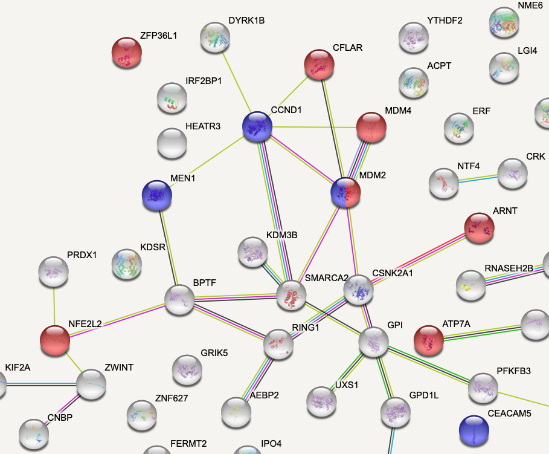
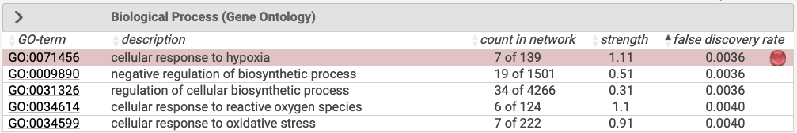
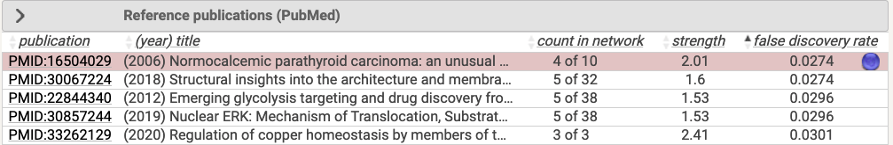

#### Day 21

There is only one synthetic lethal at day 21: **MBNL1**, an [RNA-splicing protein](https://en.wikipedia.org/wiki/MBNL1).

```{r}
a549.arh3_day21 <- crispRutils::run_synth_lethal_analysis(file.path(base_path, "A549-DiffLeth-WT-ARH3-day21"))

plot(a549.arh3_day21, type = "plasmid", remove_multimappers = T, 
     library_name = "yusa_v3_human", library_type = "n", library_annotation_version = 1)

plot(a549.arh3_day21, type = "treat", remove_multimappers = T, 
     library_name = "yusa_v3_human", library_type = "n", library_annotation_version = 1)

```

## TARG1 -/-

### HeLa

```{r,echo=F,eval=F}
# Baseline comparison.
hela.targ1_day0 <- crispRutils::run_synth_lethal_analysis(file.path(base_path.bl, "HeLa-DiffLeth-WT-TARG1-day0"))

plot(a549.arh3_day0, type = "plasmid", remove_multimappers = T, 
     library_name = "yusa_v3_human", library_type = "n", library_annotation_version = 1)

plot(a549.arh3_day0, type = "treat", remove_multimappers = T, 
     library_name = "yusa_v3_human", library_type = "n", library_annotation_version = 1)

```

#### Day 11

There are 38 synthetic lethality hits that are enriched for 'hydrofolate metabolism' - surprisingly, this is the same enrichment as genes that lost essentiality in A549 ARH3-/- at day 14, and these two gene sets share 22 genes in common.

```{r}
hela.targ1_day11 <- crispRutils::run_synth_lethal_analysis(file.path(base_path, "HeLa-DiffLeth-WT-TARG1-day11"))

plot(hela.targ1_day11, type = "plasmid", remove_multimappers = T, 
     library_name = "yusa_v3_human", library_type = "n", library_annotation_version = 1)

plot(hela.targ1_day11, type = "treat", remove_multimappers = T, 
     library_name = "yusa_v3_human", library_type = "n", library_annotation_version = 1)

hits.hela.targ1.day11 <- hela.targ1_day11$mageck_treat_vs_ctrl_ess_annot %>%
  filter(type == "Gain-Ess") %>%
  select(id,neg.lfc,neg.fdr) %>%
  arrange(neg.fdr)

write.csv(hits.hela.targ1.day11, file = "../data/fgc_0013b/fgc_0013b-synth-lethals-hela-targ1-day11.csv", row.names = F, quote=F)

```

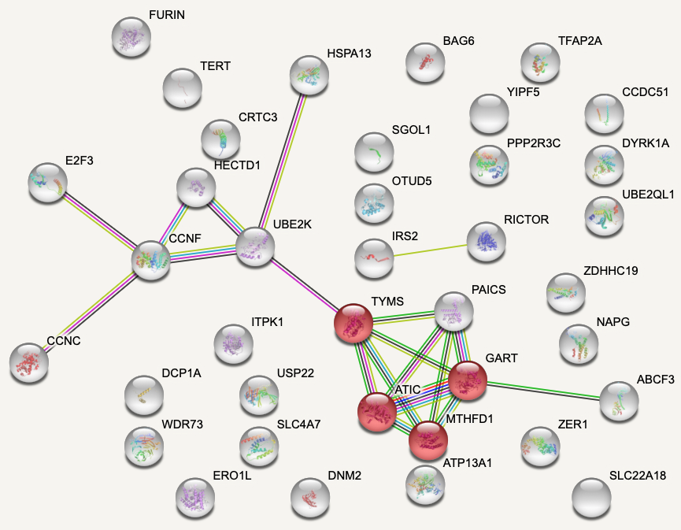
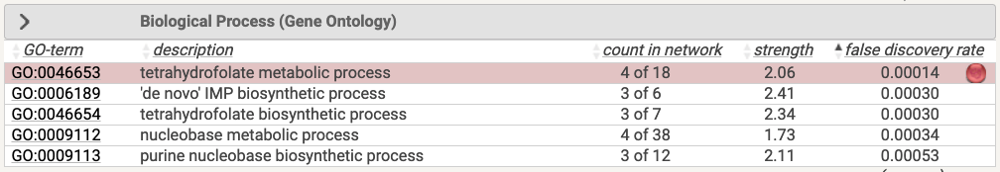

#### Day 18

There is only one synthetic lethal at day 18, DYRK1A, a [protein kinase](https://en.wikipedia.org/wiki/DYRK1A).

```{r}
hela.targ1_day18 <- crispRutils::run_synth_lethal_analysis(file.path(base_path, "HeLa-DiffLeth-WT-TARG1-day18"))

plot(hela.targ1_day18, type = "plasmid", remove_multimappers = T, 
     library_name = "yusa_v3_human", library_type = "n", library_annotation_version = 1)

plot(hela.targ1_day18, type = "treat", remove_multimappers = T, 
     library_name = "yusa_v3_human", library_type = "n", library_annotation_version = 1)

```

### U2OS

```{r,echo=F,eval=F}
# Baseline comparison.
u2os.targ1_day0 <- crispRutils::run_synth_lethal_analysis(file.path(base_path.bl, "U2OS-DiffLeth-WT-TARG1-day0"))

plot(u2os.targ1_day0, type = "plasmid", remove_multimappers = T, 
     library_name = "yusa_v3_human", library_type = "n", library_annotation_version = 1)

plot(u2os.targ1_day0, type = "treat", remove_multimappers = T, 
     library_name = "yusa_v3_human", library_type = "n", library_annotation_version = 1)

```

#### Day 14

There are 69 synthetic lethals at day 14 and they are strongly enriched for protein interactions (*P* = 7.22e-9). They are enriched for 'cellular respiration' and strongly enriched for presence in the mitochondrion (*P* = 4.14e-7).

```{r}
u2os.targ1_day14 <- crispRutils::run_synth_lethal_analysis(file.path(base_path, "U2OS-DiffLeth-WT-TARG1-day14"))

plot(u2os.targ1_day14, type = "plasmid", remove_multimappers = T, 
     library_name = "yusa_v3_human", library_type = "n", library_annotation_version = 1)

plot(u2os.targ1_day14, type = "treat", remove_multimappers = T, 
     library_name = "yusa_v3_human", library_type = "n", library_annotation_version = 1)

hits.u2os.targ1.day14 <- u2os.targ1_day14$mageck_treat_vs_ctrl_ess_annot %>%
  filter(type == "Gain-Ess") %>%
  select(id,neg.lfc,neg.fdr) %>%
  arrange(neg.fdr)

write.csv(hits.u2os.targ1.day14, file = "../data/fgc_0013b/fgc_0013b-synth-lethals-u2os-targ1-day14.csv", row.names = F, quote=F)

```

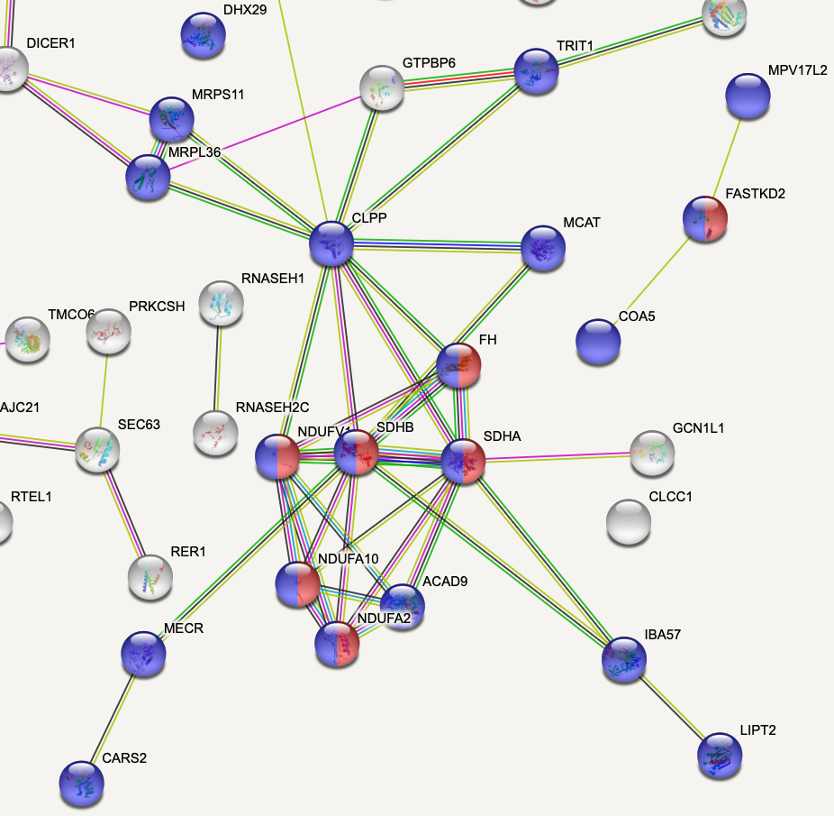
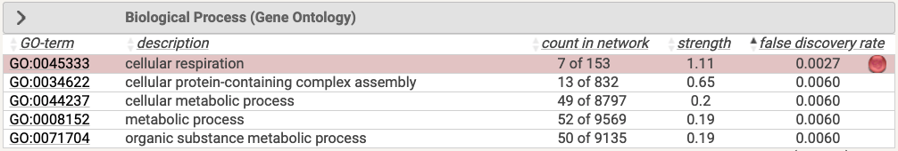
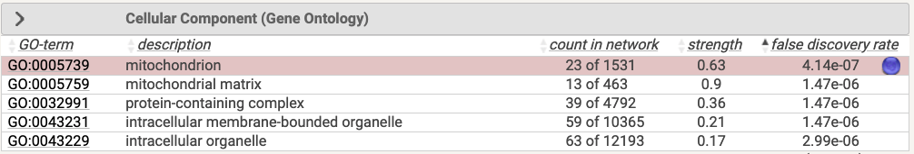

#### Day 18

There are 18 synthetic lethals at day 18 and they are enriched for 'regulation of TOR signaling'. Day 18 and day 14 share 13 of their synthetic lethal hits.

```{r}
u2os.targ1_day18 <- crispRutils::run_synth_lethal_analysis(file.path(base_path, "U2OS-DiffLeth-WT-TARG1-day18"))

plot(u2os.targ1_day18, type = "plasmid", remove_multimappers = T, 
     library_name = "yusa_v3_human", library_type = "n", library_annotation_version = 1)

plot(u2os.targ1_day18, type = "treat", remove_multimappers = T, 
     library_name = "yusa_v3_human", library_type = "n", library_annotation_version = 1)

hits.u2os.targ1.day18 <- u2os.targ1_day18$mageck_treat_vs_ctrl_ess_annot %>%
  filter(type == "Gain-Ess") %>%
  select(id,neg.lfc,neg.fdr) %>%
  arrange(neg.fdr)

write.csv(hits.u2os.targ1.day18, file = "../data/fgc_0013b/fgc_0013b-synth-lethals-u2os-targ1-day18.csv", row.names = F, quote=F)

```

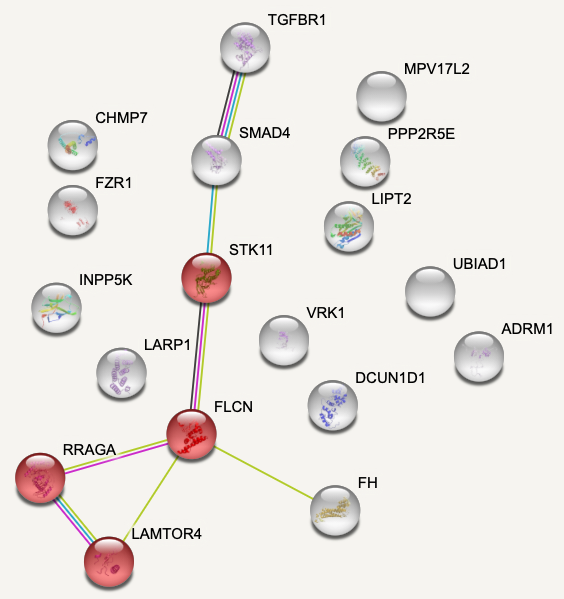


## HPF1-/-

### U2OS

```{r,echo=F,eval=F}
# Baseline comparison.
u2os.hpf1_day0 <- crispRutils::run_synth_lethal_analysis(file.path(base_path.bl, "U2OS-DiffLeth-WT-HPF1-day0"))

plot(u2os.hpf1_day0, type = "plasmid", remove_multimappers = T, 
     library_name = "yusa_v3_human", library_type = "n", library_annotation_version = 1)

plot(u2os.hpf1_day0, type = "treat", remove_multimappers = T, 
     library_name = "yusa_v3_human", library_type = "n", library_annotation_version = 1)

```

#### Day 14

There are 13 synthetic lethals at day 14 with a weak enrichment for 'protein transport'.

```{r}
u2os.hpf1_day14 <- crispRutils::run_synth_lethal_analysis(file.path(base_path, "U2OS-DiffLeth-WT-HPF1-day14"))

plot(u2os.hpf1_day14, type = "plasmid", remove_multimappers = T, 
     library_name = "yusa_v3_human", library_type = "n", library_annotation_version = 1)

plot(u2os.hpf1_day14, type = "treat", remove_multimappers = T, 
     library_name = "yusa_v3_human", library_type = "n", library_annotation_version = 1)

hits.u2os.hpf1.day14 <- u2os.hpf1_day14$mageck_treat_vs_ctrl_ess_annot %>%
  filter(type == "Gain-Ess") %>%
  select(id,neg.lfc,neg.fdr) %>%
  arrange(neg.fdr)

write.csv(hits.u2os.hpf1.day14, file = "../data/fgc_0013b/fgc_0013b-synth-lethals-u2os-hpf1-day14.csv", row.names = F, quote=F)

```

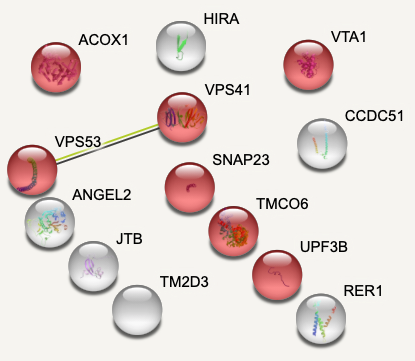
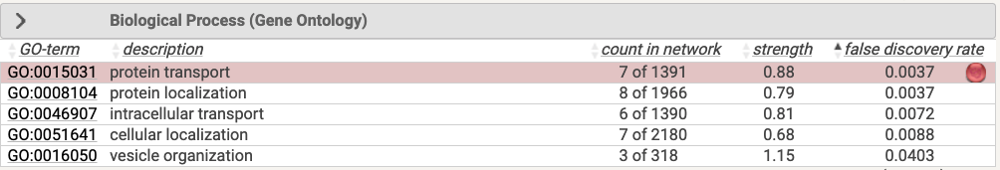

#### Day 21

```{r}
u2os.hpf1_day21 <- crispRutils::run_synth_lethal_analysis(file.path(base_path, "U2OS-DiffLeth-WT-HPF1-day21"))

plot(u2os.hpf1_day21, type = "plasmid", remove_multimappers = T, 
     library_name = "yusa_v3_human", library_type = "n", library_annotation_version = 1)

plot(u2os.hpf1_day21, type = "treat", remove_multimappers = T, 
     library_name = "yusa_v3_human", library_type = "n", library_annotation_version = 1)

```


# QC

## HeLa TARG1 Day 11

```{r}
qc.hela.targ1_day11 <- readRDS(file.path(base_path,"HeLa-DiffLeth-WT-TARG1-day11/qc/QC_fgc.rds"))

crispRutils::annotate_gene_sets_lfc_grna(qc.hela.targ1_day11) %>%
  plot()

crispRutils::plot_perf_curves_fgcQC(qc.hela.targ1_day11, "PrRc")

```

## HeLa TARG1 Day 18

```{r}
qc.hela.targ1_day18 <- readRDS(file.path(base_path,"HeLa-DiffLeth-WT-TARG1-day18/qc/QC_fgc.rds"))

crispRutils::annotate_gene_sets_lfc_grna(qc.hela.targ1_day18) %>%
  plot()

crispRutils::plot_perf_curves_fgcQC(qc.hela.targ1_day18, "PrRc")

rbind(qc.hela.targ1_day11$qc_metrics,qc.hela.targ1_day18$qc_metrics) %>%
  ggplot(aes(time_point_duration_in_days,gini_coefficient_counts,color=SampleClass)) +
  geom_point() +
  ggtitle("HeLa TARG1: gini coefficients")

```

## A549 ARH3 Day 14

```{r}
qc.a549.arh3_day14 <- readRDS(file.path(base_path,"A549-DiffLeth-WT-ARH3-day14/qc/QC_fgc.rds"))

crispRutils::annotate_gene_sets_lfc_grna(qc.a549.arh3_day14) %>%
  plot()

crispRutils::plot_perf_curves_fgcQC(qc.a549.arh3_day14, "PrRc")

```

## A549 ARH3 Day 21

```{r}
qc.a549.arh3_day21 <- readRDS(file.path(base_path,"A549-DiffLeth-WT-ARH3-day21/qc/QC_fgc.rds"))

crispRutils::annotate_gene_sets_lfc_grna(qc.a549.arh3_day21) %>%
  plot()

crispRutils::plot_perf_curves_fgcQC(qc.a549.arh3_day21, "PrRc")

rbind(qc.a549.arh3_day14$qc_metrics,qc.a549.arh3_day21$qc_metrics) %>%
  ggplot(aes(time_point_duration_in_days,gini_coefficient_counts,color=SampleClass)) +
  geom_point() +
  ggtitle("A549 ARH3: gini coefficients")

```

## U2OS HPF1 Day 14

```{r}
qc.u2os.hpf1_day14 <- readRDS(file.path(base_path,"U2OS-DiffLeth-WT-HPF1-day14/qc/QC_fgc.rds"))

crispRutils::annotate_gene_sets_lfc_grna(qc.u2os.hpf1_day14) %>%
  plot()

crispRutils::plot_perf_curves_fgcQC(qc.u2os.hpf1_day14, "PrRc")

```

## U2OS HPF1 Day 21

```{r}
qc.u2os.hpf1_day21 <- readRDS(file.path(base_path,"U2OS-DiffLeth-WT-HPF1-day21/qc/QC_fgc.rds"))

crispRutils::annotate_gene_sets_lfc_grna(qc.u2os.hpf1_day21) %>%
  plot()

crispRutils::plot_perf_curves_fgcQC(qc.u2os.hpf1_day21, "PrRc")

rbind(qc.u2os.hpf1_day14$qc_metrics,qc.u2os.hpf1_day21$qc_metrics) %>%
  ggplot(aes(time_point_duration_in_days,gini_coefficient_counts,color=SampleClass)) +
  geom_point() +
  ggtitle("U2OS HPF1: gini coefficients")

```

## U2OS TARG1 Day 14

```{r}
qc.u2os.targ1_day14 <- readRDS(file.path(base_path,"U2OS-DiffLeth-WT-TARG1-day14/qc/QC_fgc.rds"))

crispRutils::annotate_gene_sets_lfc_grna(qc.u2os.targ1_day14) %>%
  plot()

crispRutils::plot_perf_curves_fgcQC(qc.u2os.targ1_day14, "PrRc")

```

## U2OS TARG1 Day 18

```{r}
qc.u2os.targ1_day18 <- readRDS(file.path(base_path,"U2OS-DiffLeth-WT-TARG1-day18/qc/QC_fgc.rds"))

crispRutils::annotate_gene_sets_lfc_grna(qc.u2os.targ1_day18) %>%
  plot()

crispRutils::plot_perf_curves_fgcQC(qc.u2os.targ1_day18, "PrRc")

rbind(qc.u2os.targ1_day14$qc_metrics,qc.u2os.targ1_day18$qc_metrics) %>%
  ggplot(aes(time_point_duration_in_days,gini_coefficient_counts,color=SampleClass)) +
  geom_point() +
  ggtitle("U2OS TARG1: gini coefficients")

```

