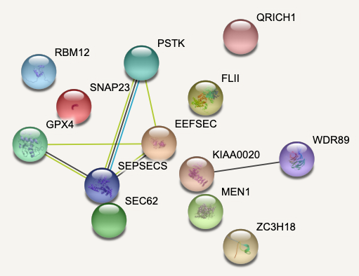
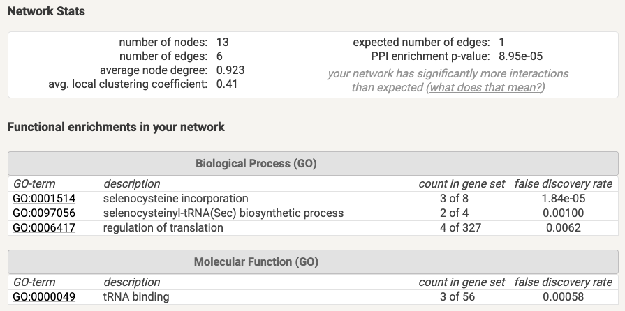
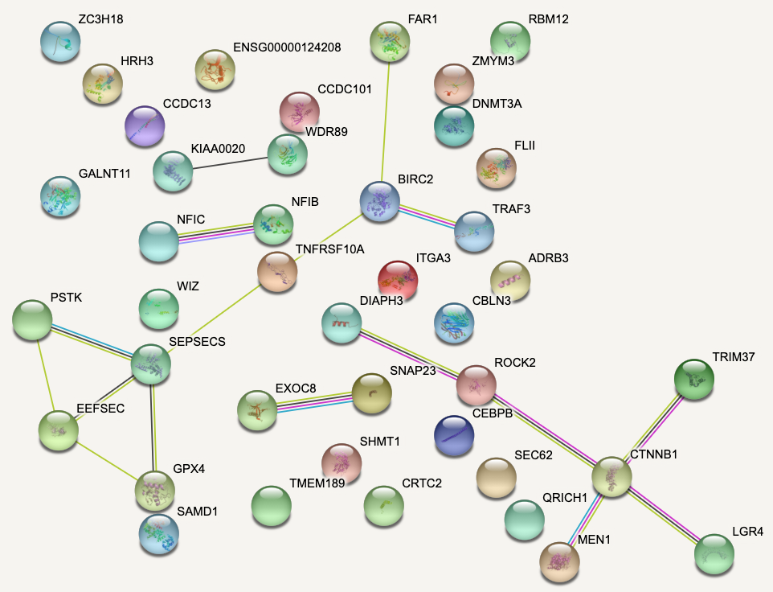
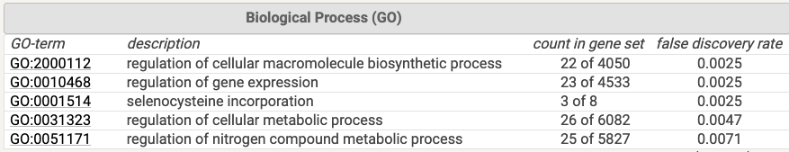
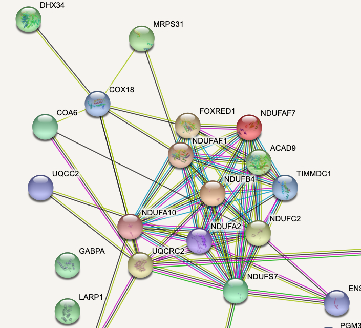
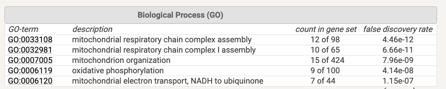

# Setup

```{r}
options(warn=-1)

suppressMessages(library(knitr))
suppressMessages(library(magrittr))
suppressMessages(library(ggplot2))
suppressMessages(library(dplyr))
suppressMessages(library(crispRutils))

base_path <- "~/data/az_cruk/fgc_0014-DiffLethality"

```

# Screen 1

## Day 10

```{r}
day10_scr1 <- crispRutils::run_synth_lethal_analysis(file.path(base_path, "A549-DiffLeth-parental-LIMD1-day10-scrn-1"))

plot(day10_scr1, type = "plasmid", remove_multimappers = T, 
     library_name = "yusa_v3_human", library_type = "n", library_annotation_version = 1)

plot(day10_scr1, type = "treat", remove_multimappers = T, 
     library_name = "yusa_v3_human", library_type = "n", library_annotation_version = 1)

```

## Day 17

```{r}
day17_scr1 <- crispRutils::run_synth_lethal_analysis(file.path(base_path, "A549-DiffLeth-parental-LIMD1-day17-scrn-1"))

plot(day17_scr1, type = "plasmid", remove_multimappers = T, 
     library_name = "yusa_v3_human", library_type = "n", library_annotation_version = 1)

plot(day17_scr1, type = "treat", remove_multimappers = T, 
     library_name = "yusa_v3_human", library_type = "n", library_annotation_version = 1)

```

# Screen 2

## Day 11

```{r}
day11_scr2 <- crispRutils::run_synth_lethal_analysis(file.path(base_path, "A549-DiffLeth-parental-LIMD1-day11-scrn-2"))

plot(day11_scr2, type = "plasmid", remove_multimappers = T, 
     library_name = "yusa_v3_human", library_type = "n", library_annotation_version = 1)

plot(day11_scr2, type = "treat", remove_multimappers = T, 
     library_name = "yusa_v3_human", library_type = "n", library_annotation_version = 1)

```

## Day 21

```{r}
day21_scr2 <- crispRutils::run_synth_lethal_analysis(file.path(base_path, "A549-DiffLeth-parental-LIMD1-day21-scrn-2"))

plot(day21_scr2, type = "plasmid", remove_multimappers = T, 
     library_name = "yusa_v3_human", library_type = "n", library_annotation_version = 1)

plot(day21_scr2, type = "treat", remove_multimappers = T, 
     library_name = "yusa_v3_human", library_type = "n", library_annotation_version = 1)

```

# Union of hits

## Gain of essentiality in LIMD1-/-

Defined as:

1. Called as essential in LIMD1-/- (Bagel or Mageck) and **not** called as essential in Parental (Bagel or Mageck).
2. An FDR < 0.1 in LIMD1-/- vs Parental Mageck comparison for negative fold-change cases.

```{r}
gain_hits_union <- unique(c((day10_scr1$mageck_treat_vs_ctrl_ess_annot %>% 
                               dplyr::filter(type == "Gain-Ess"))$id,
                     (day17_scr1$mageck_treat_vs_ctrl_ess_annot %>% 
                        dplyr::filter(type == "Gain-Ess"))$id,
                     (day11_scr2$mageck_treat_vs_ctrl_ess_annot %>% 
                        dplyr::filter(type == "Gain-Ess"))$id,
                     (day21_scr2$mageck_treat_vs_ctrl_ess_annot %>% 
                        dplyr::filter(type == "Gain-Ess"))$id))
```

Enriched for **Selenocysteine incorporation**.




## Depleted and essential in LIMD1-/-

Defined as:

1. Called as essential in LIMD1-/- (Bagel or Mageck).
2. An FDR < 0.1 in LIMD1-/- vs Parental Mageck comparison for negative fold-change cases.

```{r}
depleted_ess_hits_union <- unique(c((day10_scr1$mageck_treat_vs_ctrl_ess_annot %>% 
                                   dplyr::filter(neg.fdr < 0.1 & 
                                                   id %in% day10_scr1$essential_union$Treatment_vs_Plasmid))$id,
                     (day17_scr1$mageck_treat_vs_ctrl_ess_annot %>% 
                        dplyr::filter(neg.fdr < 0.1 &
                                        id %in% day17_scr1$essential_union$Treatment_vs_Plasmid))$id,
                     (day11_scr2$mageck_treat_vs_ctrl_ess_annot %>% 
                        dplyr::filter(neg.fdr < 0.1 & 
                                        id %in% day11_scr2$essential_union$Treatment_vs_Plasmid))$id,
                     (day21_scr2$mageck_treat_vs_ctrl_ess_annot %>% 
                        dplyr::filter(neg.fdr < 0.1 & 
                                        id %in% day21_scr2$essential_union$Treatment_vs_Plasmid))$id))

```

One additional hit: **TRIM37**.

## Depleted in LIMD1-/-

Defined as:

1. An FDR < 0.1 in LIMD1-/- vs Parental Mageck comparison for negative fold-change cases.

```{r}
depleted_hits_union <- unique(c((day10_scr1$mageck_treat_vs_ctrl_ess_annot %>% 
                                   dplyr::filter(neg.fdr < 0.1))$id,
                     (day17_scr1$mageck_treat_vs_ctrl_ess_annot %>% 
                        dplyr::filter(neg.fdr < 0.1))$id,
                     (day11_scr2$mageck_treat_vs_ctrl_ess_annot %>% 
                        dplyr::filter(neg.fdr < 0.1))$id,
                     (day21_scr2$mageck_treat_vs_ctrl_ess_annot %>% 
                        dplyr::filter(neg.fdr < 0.1))$id))

```





## Loss of essentiality in LIMD1-/-

Defined as:

1. Called as essential in Parental (Bagel or Mageck) and **not** called as essential in LIMD1-/- (Bagel or Mageck).
2. An FDR < 0.1 in LIMD1-/- vs Parental Mageck comparison for positive fold-change cases.

```{r}
loss_hits_union <- unique(c((day10_scr1$mageck_treat_vs_ctrl_ess_annot %>% 
                               dplyr::filter(type == "Loss-Ess"))$id,
                     (day17_scr1$mageck_treat_vs_ctrl_ess_annot %>% 
                        dplyr::filter(type == "Loss-Ess"))$id,
                     (day11_scr2$mageck_treat_vs_ctrl_ess_annot %>% 
                        dplyr::filter(type == "Loss-Ess"))$id,
                     (day21_scr2$mageck_treat_vs_ctrl_ess_annot %>% 
                        dplyr::filter(type == "Loss-Ess"))$id))

```

Very strong enrichment for **mitochondrial oxidative phosphorylation**.





## Saving hits

```{r}
depleted_hits <- data.frame(gene = unique(c(gain_hits_union, depleted_ess_hits_union, depleted_hits_union)), 
                            stringsAsFactors = F) %>%
  dplyr::mutate(Gain_lethality_LIMD1 = as.integer(gene %in% gain_hits_union),
                Depleted_and_lethal_LIMD1 = as.integer(gene %in% depleted_ess_hits_union),
                Depleted_LIMD1 = as.integer(gene %in% depleted_hits_union))

out_file <- "../data/fgc_0014--depleted-hits.csv"
write.csv(depleted_hits, file = out_file, quote=F, col.names = F, row.names = F)

cat(paste("depleted hits written to:",out_file))

out_file <- "../data/fgc_0014--loss-lethality-hits.csv"
cat(loss_hits_union, file = out_file, sep = "\n")

cat(paste("loss-of-lethality hits written to:",out_file))

```


# QC

## Day 10, screen 1

```{r}
qc <- readRDS(file.path(base_path,"A549-DiffLeth-parental-LIMD1-day10-scrn-1/qc/QC_fgc.rds"))

crispRutils::annotate_gene_sets_lfc_grna(qc) %>%
  plot()

crispRutils::plot_perf_curves_fgcQC(qc, "PrRc")

```

## Day 17, screen 1

```{r}
qc <- readRDS(file.path(base_path,"A549-DiffLeth-parental-LIMD1-day17-scrn-1/qc/QC_fgc.rds"))

crispRutils::annotate_gene_sets_lfc_grna(qc) %>%
  plot()

crispRutils::plot_perf_curves_fgcQC(qc, "PrRc")

```

## Day 11, screen 2

```{r}
qc <- readRDS(file.path(base_path,"A549-DiffLeth-parental-LIMD1-day11-scrn-2/qc/QC_fgc.rds"))

crispRutils::annotate_gene_sets_lfc_grna(qc) %>%
  plot()

crispRutils::plot_perf_curves_fgcQC(qc, "PrRc")

```

## Day 21, screen 2

```{r}
qc <- readRDS(file.path(base_path,"A549-DiffLeth-parental-LIMD1-day21-scrn-2/qc/QC_fgc.rds"))

crispRutils::annotate_gene_sets_lfc_grna(qc) %>%
  plot()

crispRutils::plot_perf_curves_fgcQC(qc, "PrRc")

```

